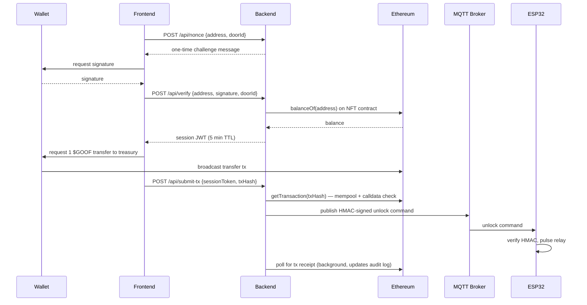

# BlockLock

A blockchain-gated physical door lock. Own the right NFT, sign a challenge with your wallet, pay a small token toll — an ESP32-controlled relay opens the door.

Built end-to-end: Solidity contracts, a Node.js verification/signaling backend, a React + wagmi frontend, and ESP32 firmware talking over MQTT — plus the infra to run it on a real server, guarding a real door.

**Live status:** deployed and running on Sepolia testnet against a physical relay/door installation. Mainnet cutover is a config change — see [Status](#status).

## Contents

- [Demo](#demo)
- [How it works](#how-it-works)
- [Why this exists](#why-this-exists)
- [Security design](#security-design)
- [Stack](#stack)
- [Repo layout](#repo-layout)
- [Status](#status)
- [Local setup](#local-setup)
- [Docs](#docs)

## Demo

*(video/GIF of the physical unlock goes here — wallet sign → token transfer → relay click → door opens)*

## How it works



## Why this exists

Most "NFT-gated" demos stop at checking a wallet's holdings in a UI. This project pushes that verification the rest of the way to a physical actuator, which means every trust boundary along the path — wallet signature, on-chain ownership, token payment, command transport — has to hold up against someone standing at the door trying to get in for free.

## Security design

- **Wallet-signature auth** — the door never trusts a wallet address by itself; the client must sign a per-request nonce (`ethers.verifyMessage`), and the nonce is single-use and TTL-bound (`nonceStore.js`) to stop replay of the *signature*.
- **Two-factor unlock** — holding the gating NFT alone isn't enough. After signature + ownership check, the wallet must also broadcast a live $GOOF token transfer; the backend validates that transaction is genuinely in the mempool, calling the right contract, and paying the treasury address before it will unlock anything (`unlockRouter.js`, `blockchain.js`).
- **Short-lived session tokens** — a JWT issued after step 1 scopes and time-bounds the window to complete step 2, rather than trusting a single long-lived credential.
- **HMAC-signed MQTT commands** — the unlock signal to the ESP32 is authenticated with HMAC-SHA256 over the full payload (`mqttService.js` → `blocklock_main.ino`), so an attacker on the broker can't forge a valid unlock without the shared secret.
- **Rate limiting** — `unlockLimiter` and `nonceLimiter` throttle verify/submit-tx/nonce endpoints per wallet or IP.
- **Full audit trail** — every attempt (granted, denied, tx pending, tx failed) is logged to SQLite with wallet, door, and failure reason, plus optional Discord alerts on denials and failed on-chain confirmations.

### Known limitations

- **MQTT replay window is not yet enforced.** The unlock payload carries a `timestamp` and `MAX_COMMAND_AGE_SECONDS` is defined in `config.h`, but the firmware doesn't currently check command age, and the nonce-dedup ring in `blocklock_main.ino` is declared but not wired up. A captured HMAC-signed message could be replayed to unlock the door without a new token payment. **Priority fix** — tracked as the top item before this goes anywhere beyond a testnet demo.
- **TLS certificate verification is off by default** (`wifiClient.setInsecure()`) for easier dev bring-up. `docs/deployment.md` documents swapping in CA-cert pinning for production; it isn't the default.
- **Rate limits are tuned for testing** (50 unlock attempts/min per wallet) — tighten before any real-world deployment.

## Stack

| Layer | Tech |
|---|---|
| Contracts | Solidity, Hardhat, OpenZeppelin (mock NFT + $GOOF token for testnet) |
| Backend | Node.js, Express, ethers.js, MQTT.js, better-sqlite3, JWT |
| Frontend | React, Vite, wagmi, WalletConnect |
| Firmware | ESP32 (Arduino), PubSubClient over MQTT/TLS |
| Infra | Mosquitto (MQTT broker), Nginx, DigitalOcean droplet |

## Repo layout

```
contracts/   Solidity contracts + Hardhat deploy scripts (mock NFT/token for Sepolia testing)
backend/     Express API — signature verification, NFT/tx validation, MQTT publishing, audit log
frontend/    React dApp — wallet connect, unlock flow UI
firmware/    ESP32 sketches — door controller + NFC tag writer
infra/       Mosquitto/Nginx config and server setup script
docs/        Architecture deep-dive + full deployment walkthrough (testnet → mainnet)
```

## Status

Deployed and running against Sepolia testnet against a live physical relay/door setup. Mainnet cutover is a config change (contract + RPC addresses) documented in [`docs/deployment.md`](docs/deployment.md) — see that file for the full setup walkthrough, from account creation through server provisioning.

### Deployed contracts (Sepolia testnet, chain ID 11155111)

| Contract | Address | Published |
|---|---|---|
| `MockGoofballGang` (NFT) | [`0x2a4a9863ff2015c4E286fcb28bdC310f476E2f80`](https://sepolia.etherscan.io/address/0x2a4a9863ff2015c4E286fcb28bdC310f476E2f80) | 2026-09-03 |
| `MockGoof` (ERC-20) | [`0xF33674bD74D8acE3f183A3A197Fd16B11A700f34`](https://sepolia.etherscan.io/address/0xF33674bD74D8acE3f183A3A197Fd16B11A700f34) | 2026-09-03 |

These are testnet mock stand-ins (`contracts/scripts/deploy.js`) for the real collection/token mainnet would gate against — Goofball Gang NFT (`0xf1987f66553460a4f0730ce17484f5a9a2e883a6`) and $GOOF token (`0x84802079Fde7658F9D0969810693a2FA1870EEdF`).

## Local setup

Each subproject has its own `.env.example` — copy to `.env` and fill in your own values (RPC keys, contract addresses, secrets). Firmware config is in `firmware/blocklock_main/config.h.example` — copy to `config.h` before flashing. See [`docs/deployment.md`](docs/deployment.md) for the full walkthrough.

## Docs

- [`docs/architecture.md`](docs/architecture.md) — component breakdown, request flow, trust boundaries, and design rationale
- [`docs/deployment.md`](docs/deployment.md) — Sepolia → mainnet deployment walkthrough
- [`docs/wiring.md`](docs/wiring.md) — relay/lock/ESP32 wiring diagram
